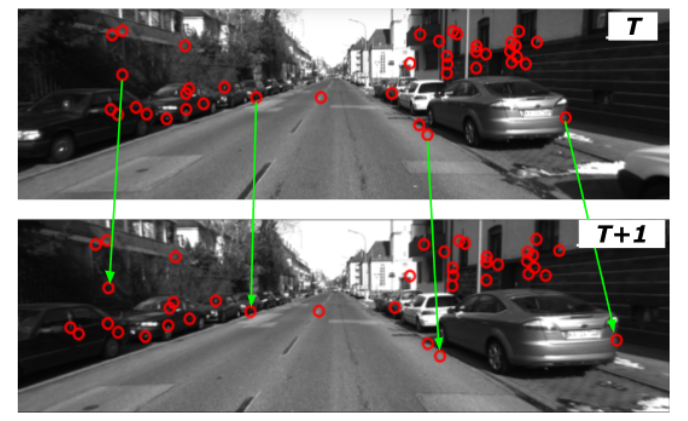

# Stereo Visual Odometry

This project aims to calculate the relative pose between consecutive stereo image pairs by minimizing the reprojection error in 3D-2D motion estimation framework.

## Requirements 
```
OpenCV 4.2.0
scipy 
numpy
date_time
system
```

## Project Pipeline 

1. Disparity Map Generation <br />
Block matching algorithm has been employed to obtain the disparity map of the scene from the stereo image pair. <br />
2. FAST Feature detection <br />
3. Lucas-Kanade Optical flow <br />

4. Rejection of non-stationary points <br />
Two methods have been implemented and compared to obtain the stationary points in the scene : Inlier detection using the Maximum Clique algorithm and a novel Outlier rejection method which is a variant of the Maximum Clique algorithm that does not rely on an arbitrary threshold as its predecessor. <br />
5. Least squares minimization of the reprojection error involving the 3D and 2D-point correspondences. <br />

Please refer the [Stereo_VO_Report.pdf](Stereo_VO_Report.pdf) for more details.


## Results


